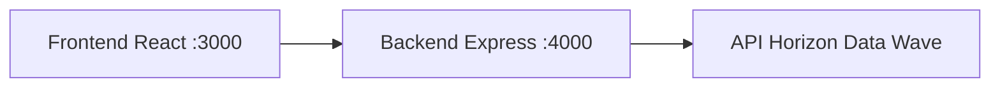
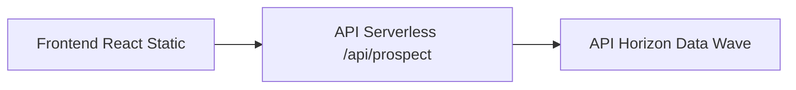

# hdw-server-front-back

Ce dépôt contient une application complète permettant d'exploiter la puissance du serveur HDW MCP (Model Context Protocol) pour accéder aux données LinkedIn via l'API Horizon Data Wave, avec une interface frontend React clé en main.

**🚀 Optimisé pour le déploiement Vercel avec architecture serverless !**

---

## Fonctionnalités principales
- Recherche de prospects LinkedIn par mots-clés, secteur, localisation
- Affichage d'une fiche prospect enrichie (nom, secteur, localisation, description, photo, lien LinkedIn)
- Architecture modulaire optimisée pour Vercel :
  - **Frontend** : Application React (Create React App) servie en statique
  - **Backend** : Fonctions serverless Vercel (`/api/prospect`) qui font le lien avec l'API Horizon Data Wave
- Prêt à être déployé sur Vercel ou étendu pour d'autres usages

---

## Structure du projet

```
/frontend               # Frontend React (Create React App)
/api                    # Fonctions serverless Vercel
  prospect.js           # API endpoint pour la recherche de prospects
/backend-local          # Backend MCP + Express (pour développement local uniquement)
  /src                  # Code source principal
vercel.json             # Configuration Vercel
.cursor/rules           # Règles Cursor pour l'intégration et la navigation
README.md               # Ce guide
```

---

## Prérequis
- Node.js >= 18
- Un compte sur https://app.horizondatawave.ai pour obtenir :
  - `HDW_ACCESS_TOKEN`
  - `HDW_ACCOUNT_ID`
- Un compte Vercel (gratuit) pour le déploiement

---

## Installation et configuration

### Développement local

1. **Clone du dépôt**
   ```bash
   git clone https://github.com/Lofp34/hdw-server-front-back.git
   cd hdw-server-front-back
   ```

2. **Configuration des variables d'environnement**
   - Crée un fichier `.env` dans `backend-local` (pour développement local uniquement) :
     ```env
     HDW_ACCESS_TOKEN=ton_token
     HDW_ACCOUNT_ID=ton_account_id
     ```

3. **Installation des dépendances**
   ```bash
   npm run install-all
   ```

4. **Lancement en développement**
   ```bash
   # Terminal 1 : Backend Express (pour développement)
   npm run dev
   
   # Terminal 2 : Frontend React
   npm run start
   ```

### Déploiement Vercel

1. **Préparer le déploiement**
   ```bash
   # Build du frontend
   npm run build
   ```

2. **Déployer sur Vercel**
   - Connecte ton repo GitHub à Vercel
   - Ajoute les variables d'environnement dans Vercel :
     - `HDW_ACCESS_TOKEN`
     - `HDW_ACCOUNT_ID`
   - Vercel détectera automatiquement la configuration et déploiera

3. **URLs de déploiement**
   - Frontend : `https://ton-projet.vercel.app`
   - API : `https://ton-projet.vercel.app/api/prospect`

---

## Utilisation

### En développement local
- Le frontend appelle `http://localhost:4000/prospect` (backend Express)
- Saisir un nom, secteur ou localisation dans le formulaire de recherche
- Cliquer sur "Rechercher" pour obtenir la fiche prospect LinkedIn

### En production (Vercel)
- Le frontend appelle `/api/prospect` (fonction serverless)
- Même interface utilisateur, même fonctionnalités
- Performance optimisée grâce à l'architecture serverless

---

## Architecture technique

### Développement local


### Production Vercel


---

## Bonnes pratiques & extension

### Ajouter de nouvelles fonctionnalités
1. **Créer une nouvelle fonction serverless** dans `/api/` (ex: `/api/chat.js`)
2. **Adapter le frontend** pour appeler la nouvelle API
3. **Déployer** : Vercel détectera automatiquement les nouvelles fonctions

### Exemple d'extension
```javascript
// api/chat.js
export default async function handler(req, res) {
  // Logique pour envoyer un message LinkedIn
  // Appel à l'API HDW pour la fonctionnalité chat
}
```

---

## Dépannage

### Développement local
- Si le port 4000 est occupé, tuer le processus ou modifier le port
- Vérifier les logs backend pour diagnostiquer les appels MCP

### Production Vercel
- Vérifier les variables d'environnement dans le dashboard Vercel
- Consulter les logs de fonction dans Vercel > Functions
- Tester l'API directement : `https://ton-projet.vercel.app/api/prospect`

---

## Avantages de l'architecture Vercel

✅ **Performance** : Frontend servi en statique, API serverless à la demande  
✅ **Scalabilité** : Fonctions serverless s'adaptent automatiquement  
✅ **Coût** : Gratuit pour usage personnel/petit projet  
✅ **Simplicité** : Déploiement automatique depuis GitHub  
✅ **Flexibilité** : Peut facilement ajouter d'autres fonctions serverless  

---

## Licence
MIT

---

## Auteur
Laurent Serre & Horizon Data Wave

---

## Ressources utiles
- [Documentation HDW MCP Server](https://github.com/horizondatawave/hdw-mcp-server)
- [API Horizon Data Wave](https://app.horizondatawave.ai)
- [Vercel Serverless Functions](https://vercel.com/docs/functions/serverless-functions)
- [Create React App](https://github.com/facebook/create-react-app) 